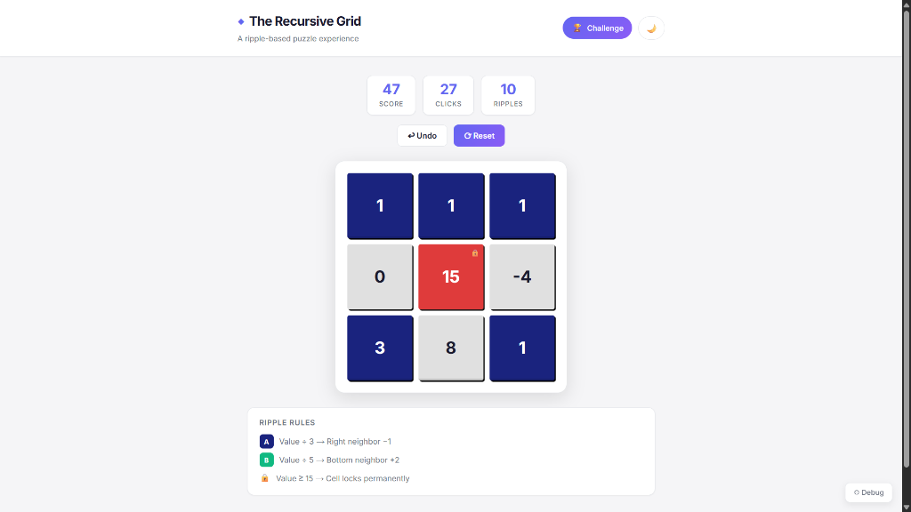

# ◆ The Recursive Grid

A dynamic 3×3 grid puzzle with recursive ripple interactions, built with Next.js and Tailwind CSS.


🔗 **Live Demo:** [the-recursive-grid-beta.vercel.app](https://the-recursive-grid-beta.vercel.app)

---

## Screenshots

### Challenge Mode — Light Theme


> The grid in action during **Challenge Mode** — tracking score, clicks, and ripple triggers in real-time. Cell `[1,1]` has reached value **15** and is now **locked** (red). Negative values from ripple effects are visible on cell `[1,2]`. The rules legend below the grid explains the ripple mechanics at a glance.

---

## Overview

The Recursive Grid is an interactive puzzle where clicking cells triggers cascading ripple effects across the board. Each cell tracks a numeric value that changes based on click actions and ripple rules. Cells lock permanently at value ≥ 15, creating strategic depth.

---

## Features

| Feature | Description |
|---------|-------------|
| **3×3 Grid** | Centered, responsive grid with animated cells |
| **Ripple Logic** | Rule A (÷3 → right −1) and Rule B (÷5 → bottom +2) |
| **Lock System** | Cells lock at value ≥ 15 (red, immutable) |
| **Challenge Mode** | Score tracking, click/ripple counters, win condition |
| **Dark Mode** | Full theme toggle with CSS custom properties |
| **Undo/History** | Last 10 state snapshots with safe undo (respects locks) |
| **Debug Panel** | Toggleable developer view (Ctrl+D) |
| **Animations** | Bounce clicks, ripple pulses, lock-in transitions |
| **Responsive** | Desktop and mobile support |
| **Accessibility** | Keyboard navigation, ARIA labels, focus indicators |

---

## Tech Stack

- **Framework:** Next.js 16 (App Router)
- **UI:** React 19
- **Styling:** Tailwind CSS 4 + Custom CSS properties
- **Font:** Inter (Google Fonts)
- **Deployment:** Vercel

---

## Architecture

```
src/
├── app/
│   ├── globals.css      # Theme system, animations, responsive styles
│   ├── layout.js        # Root layout with SEO metadata
│   └── page.js          # Main page composing all components
├── components/
│   ├── Box.jsx          # Individual grid cell with state-based styling
│   ├── Grid.jsx         # 3×3 grid container
│   ├── Header.jsx       # Title, mode toggle, theme toggle
│   ├── GamePanel.jsx    # Challenge mode stats and controls
│   ├── DebugPanel.jsx   # Developer debugging panel
│   └── Footer.jsx       # Branding footer
├── hooks/
│   └── useGridState.js  # Custom hook managing all state
└── utils/
    └── gridLogic.js     # Pure business logic functions
```

### Logic Separation

All business logic is isolated in `utils/gridLogic.js` as pure functions:
- `processClick()` — orchestrates increment + ripple rules
- `applyRippleA()` — right neighbor rule (÷3 → −1)
- `applyRippleB()` — bottom neighbor rule (÷5 → +2)
- `isLocked()`, `canClick()`, `isGameWon()` — state validators

The custom hook `useGridState()` manages all reactive state (grid, history, scores, theme) and exposes a clean API to components.

---

## Ripple Rules

### Rule A: Right Neighbor
When a cell's value is divisible by **3**, the cell to its **right** decreases by 1.
- Skipped if cell is in the last column
- Skipped if target is locked

### Rule B: Bottom Neighbor
When a cell's value is divisible by **5**, the cell **below** increases by 2.
- Skipped if cell is in the last row
- Skipped if target is locked

---

## Color Rules

| State | Background | Text |
|-------|-----------|------|
| Even value | Light Gray (#e0e0e0) | Default |
| Odd value | Navy Blue (#1a237e) | White |
| Locked (≥15) | Red | White |

---

## Getting Started

### Prerequisites
- Node.js 18+
- npm 9+

### Installation

```bash
git clone https://github.com/Anurag-elitx/The-Recursive-Grid.git
cd The-Recursive-Grid
npm install
```

### Development

```bash
npm run dev
```

Open [http://localhost:3000](http://localhost:3000).

### Production Build

```bash
npm run build
npm start
```

---

## Edge Case Handling

| Scenario | Handling |
|----------|---------|
| Boundary ripple (last col/row) | Safely ignored, no crash |
| Locked ripple target | Update skipped |
| Rapid clicking | Stable state via React batching |
| Undo after lock | Blocked if it would un-lock a cell |
| Multiple ripples | Sequential processing |

---

## Known Limitations

- Undo cannot restore a state that would un-lock a currently locked cell
- History is capped at 10 snapshots to manage memory

## Future Improvements

- Sound effects for clicks and ripples
- Leaderboard with localStorage persistence
- Configurable grid size (4×4, 5×5)
- Multiplayer mode
- Animation speed controls

---

Built by **Anurag Kumar**
